# INST767 Project: F1 Racing and EPL Data with Country GDP Pipeline

## Group 9: Kamran Djourshari, Steicy Singh, Saran Ram, Sean Mussenden, Angela Tseng, Hrday Kowdley

## Introduction
For this project, we focused on various aspects to ensure a smooth functioning 
data-pipeline. The topic we chose to cover was F1 Racing and the English Premier
League (EPL) Football relation to GDP of countries, using Racers and
players' ethnicities. This was broken into 4 different steps, which 
will be covered here. These four steps include ingestion, transformation, 
storage and analysis. For this to occur we used Google Cloud to create this 
project. 

## Ingestion
For this step, we conducted this using five different Cloud Functions which call
from these different free open-sourced APIs. Each of these Cloud Functions store
their data into their own seperate intermediate cloud storage Google Bucket as
.csv files.
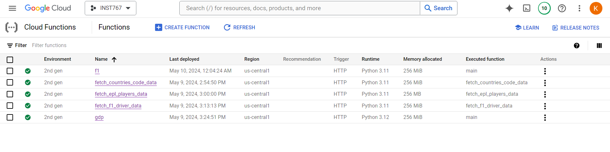

Below are all of our functioning Google Cloud Functions with a brief summary of
their API source and code:

1. [**Cloud_Functions/fl_data.py**](https://github.com/KamranDjourshari24/INST767_Project/blob/main/Cloud_Functions/f1_data.py): This code pulls data from Ergast API, which 
    contains information about all the Formula 1 Races. Our code pulls in all 
    the races starting from 2005 (the earliest the API allows for) all the way 
    to the current year (using the Datatime Module), which allows for our code 
    to remain dynamic no matter what year it is. Once gathered, it sends all the
    data to the ***f1_race_info*** bucket.
    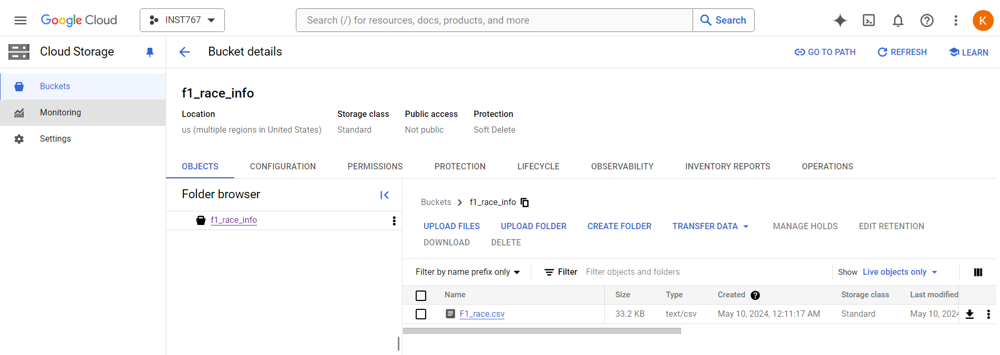

2. [**Cloud_Functions/fetch_countries_code_data.py**](https://github.com/KamranDjourshari24/INST767_Project/blob/main/Cloud_Functions/fetch_countries_code_data.py): Pulling data from the 
    SportsMonk API source, this returns all the Countries information (id, name, 
    iso2, iso3 code). It stores the data in the ***countries_code_data*** 
    bucket.
    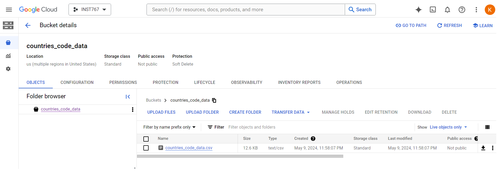

3. [**Cloud_Functions/fetch_epl_players_data.py**](https://github.com/KamranDjourshari24/INST767_Project/blob/main/Cloud_Functions/fetch_epl_players_data.py): This also pulls data from the 
    SportsMonk API source for English Premier League Players, including their 
    name, country of origin and date of birth. The data is then stored in the 
    ***epl_players_data*** bucket.
    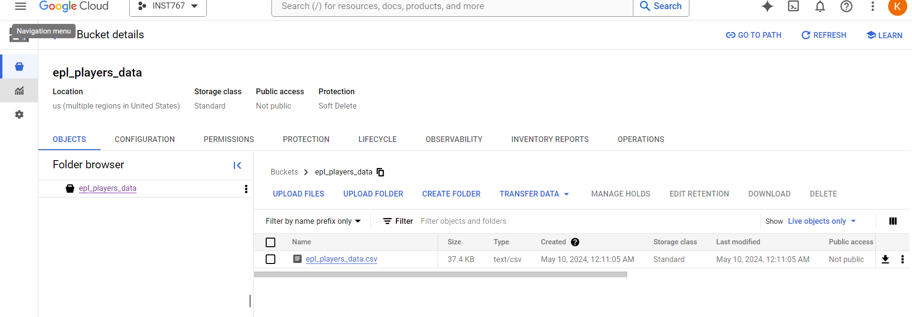   
    
4. [**Cloud_Functions/fetch_f1_drivers_data.py**](https://github.com/KamranDjourshari24/INST767_Project/blob/main/Cloud_Functions/fetch_f1_drivers_data.py): This retrieves data from the 
    SportsMonk API source for F1 Drivers in current races also, including their 
    name, country of origin and date of birth. The data is then stored in the 
    ***f1_driver_data*** bucket.   
    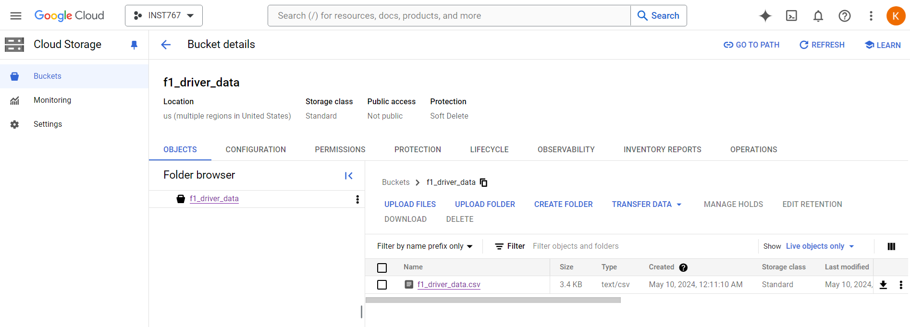

5. [**Cloud_Functions/get_gdp_data.py**](https://github.com/KamranDjourshari24/INST767_Project/blob/main/Cloud_Functions/get_gdp_data.py): Pulling data from the World Bank and 
    IMF APIs we are able to pull in all countries GDP data (value and change 
    rate) starting from 1980 to present time. NOTE: We had to pull from two 
    different APIs as the World Bank API doesn't return GDP data of all
    countries from one query/API call. Instead we had to query each country with 
    the World Bank API and pull the necessary data. We were able to query by 
    each country by using the IMFs API which returns all country names. The data 
    is then stored in the ***gdp_bank*** bucket.
    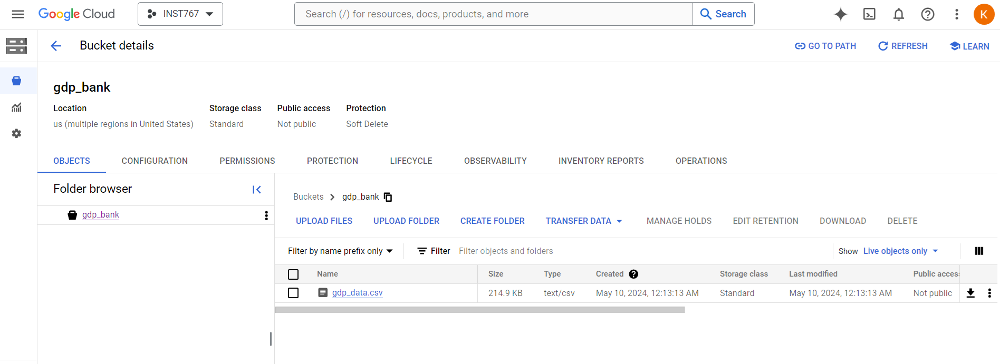 

From here, we set up individual Cloud schedulers for each of these Functions (excluding the country
function as that most likely won't ever have new data), which each have their own set timeframes. 
Once these schedulers are run, they overwrite the existing .csv file in the given bucket with the 
new data in the same filename. Below shows evidence of the Schedulers working for each of the 
assigned Functions:

- **epl_call**: This scheduler is set to run the first of the month every September and February 
    at 12 AM UTC after the closing of Transfer Window (where players are bought and sold to Premier 
    League Teams). 
      

    Bucket with new data (shown with Last Modied Time):
    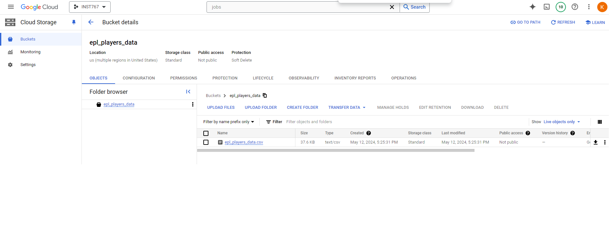  

- **f1_driver_call**: This scheduler is set to run before the start of every F1 Racing season at 
    12:20 AM UTC timezone on February 23rd with the new driver data. 
      

    Bucket with new data (shown with Last Modied Time):
    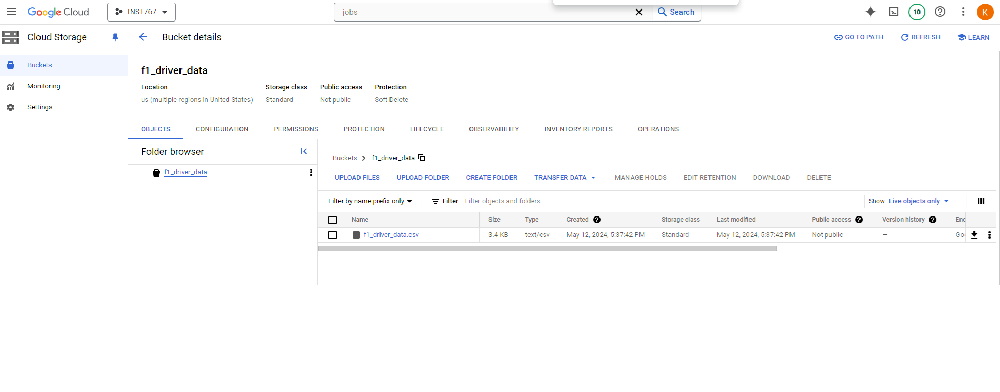

- **gdp_call**: This scheduler is set to run every 6 months starting from January. The goal
    is to gather new GDP data for the year within this time period as the release of new GDP data
    from the World Bank is somewhat unknown. 
      

    Bucket with new data (shown with Last Modied Time):
    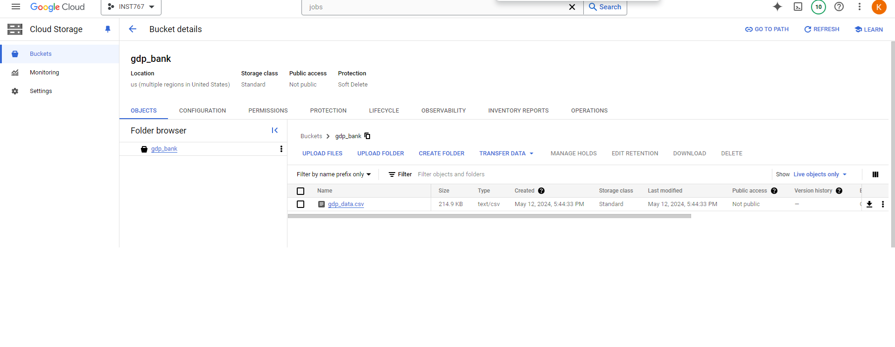

- **race_f1_call**: This scheduler is set to run yearly on February 2nd at 5:00 AM UTC Timezone. 
    The goal of this is to gather the new year's schedule which always released sometime before 
    February (the starting month of the new F1 Season). As the new year schedule release data varies
    yearly, we chose beginning of February just before the new season.  
      

    Bucket with new data (shown with Last Modied Time):
    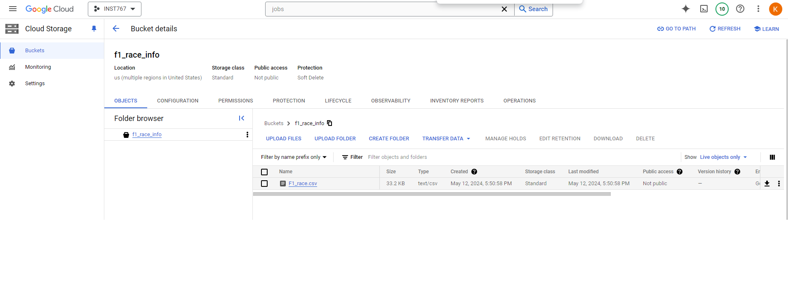

## Transformation
For the next step of the Pipeline, we created a controlled Dataproc Workflow which contains multiple jobs
of cleaning the various data using PySpark from the buckets and sending it as various table to 
BigQuery. For this to work we designed a Workflow template which contains multiple different jobs of 
data cleaning, with no dependency on each other, which are explained here:

- **job-gdp-country**: The code used for this job is stored in [***cluster_job/gdp_country.py***](https://github.com/KamranDjourshari24/INST767_Project/blob/main/cluster_job/gdp_country.py). 
This job specifically only cleans the GDP and Country CSVs into one organized table. 
The tasks for this  job was to read in these two CSVs (from their given buckets mentioned above) and 
then merge them together into DataFrame. From there, we only selected necessary columns and then 
assigned them to the correct Datatype before it was, lastly sent to BigQuery under the datset 
*finalproject* under the table name gdp_country. 
Here is the Pyspark File stored in a bucket being used:  
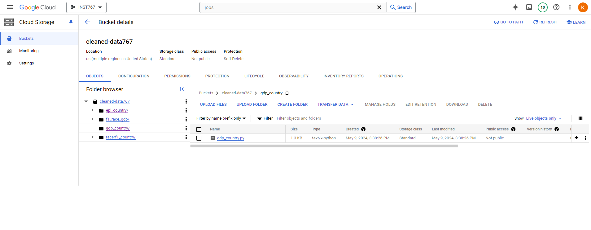

- **job-Racerf1-country**: The code used for this job is stored in [***cluster_job/f1_racer_country.py***](https://github.com/KamranDjourshari24/INST767_Project/blob/main/cluster_job/f1_racer_country.py).
This job specifically cleans up the Country CSV and F1 Driver Data into one cleaned dataset using 
Pyspark. After reading in these two dataframes, it adjusts some of the country codes for Countries 
where the ISO codes vary betweeen these two dataframes and then joins them together using the 
Country code (from both F1 Race and country dataframe). The columns selected are adjusted and aliased
to their correct datatype and sent to BigQuery under the table name racerf1_country.
Here is the Pyspark File stored in a bucket being used:  
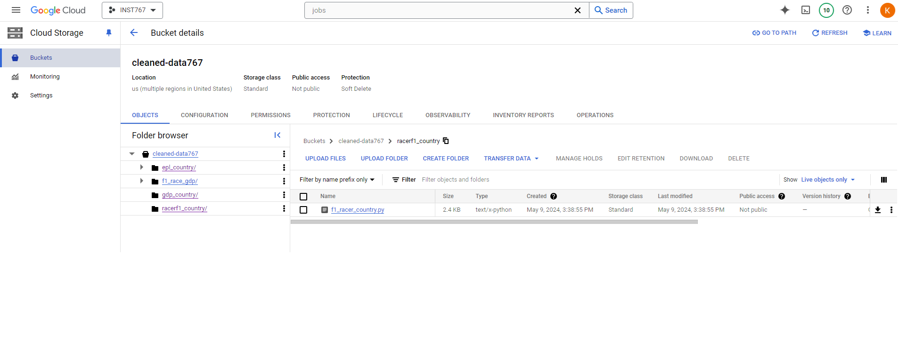

- **job-epl-country**: The code used for this job is stored in [***cluster_job/eplplayer_country.py***](https://github.com/KamranDjourshari24/INST767_Project/blob/main/cluster_job/eplplayer_country.py). 
This job calls on the EPL player CSV and Country CSV stored in their respective bucket. For this 
aspect, these two CSVs were read in using Pyspark as DataFrames and joined together using Country ID.
From there data cleaning occured with the renaming of the Name column to Country Name and the dropping
of NULL rows in the dataset. Also standardization occured with the new column formed for Birth Year being 
extracted from the Date of Birth. We then set the correct datatypes of the needed columns and aliased 
them and then sent it to BigQuery under the table name epl_country. 
Here is the Pyspark File stored in a bucket being used:  
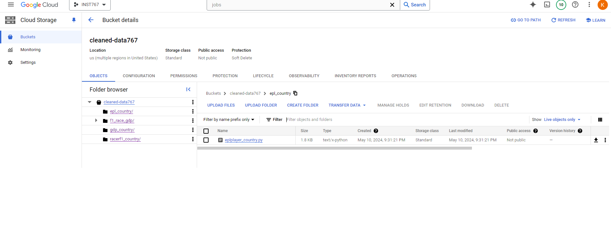

- **job-f1-race**: The code used for this job is stored in [***cluster_job/f1_race_gdp.py***](https://github.com/KamranDjourshari24/INST767_Project/blob/main/cluster_job/f1_race_gdp.py).
This last job reads in the F1 Race and GDP data from their stored buckets. Then data cleaning occurs
using Pyspark where they are joined together using the Country Name from both datasets. As there 
were standardization issues between these two datasets in terms of Country Name, we renamed certain 
Country names to match beforehand in this as well (for example UAE was renamed to United Arab 
Emirates). The Time and Date were combined into one concatanated column as well. We then set the correct 
datatypes for the given columns and then wrote it to BigQuery under the table name f1_race.
Here is the Pyspark File stored in a bucket being used:  
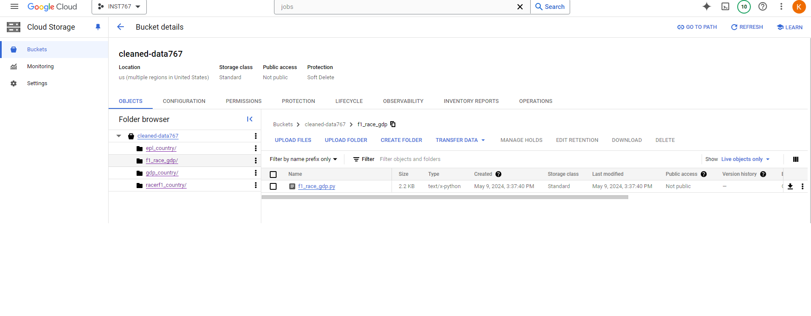

In order to automate this process, we set a Cloud Scheduler which would call this Dataproc WorkFlow. 
We set it to run Weekly on Monday at 5 AM UTC Timezone. As shown here: 

Once triggered, it creates a temporary cluster, which executes these four jobs mentioned above, which can
be shown as runned successfully here: 
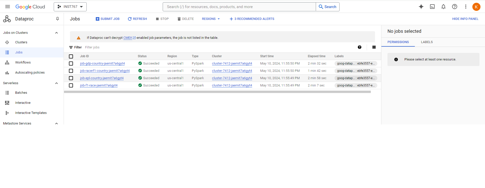

